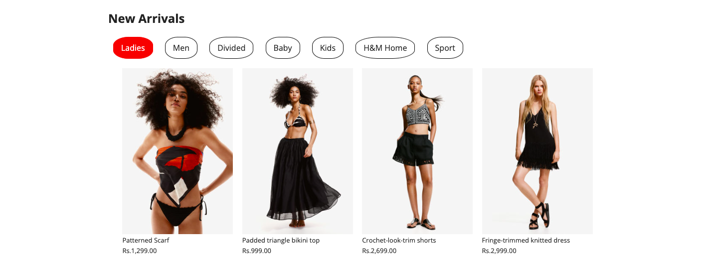
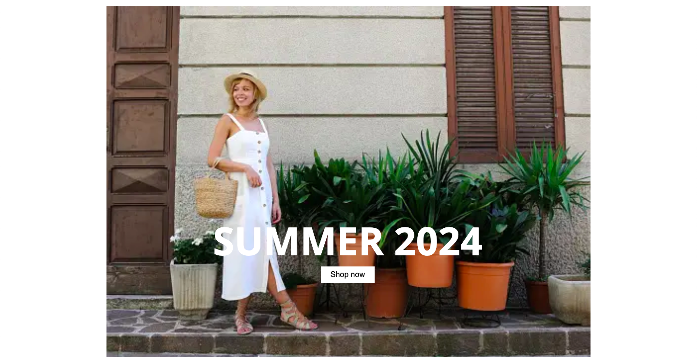
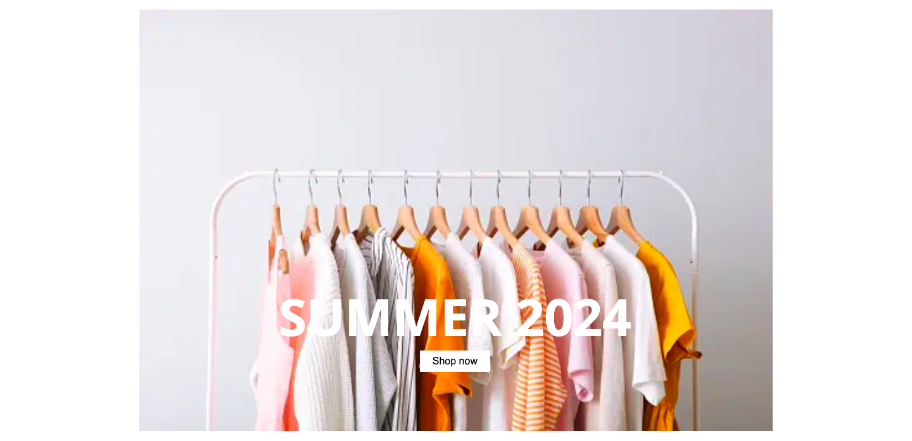

# H&M Clone

## Usage

Follow these steps to run the project locally.

1. Clone the repository
   git clone https://github.com/pandeyakash/H-M_Clone.git

2. Run with live server

## Project

1. Navbar
   

2. Main Content
     
     
     
     
     
   

3. Footer
   
